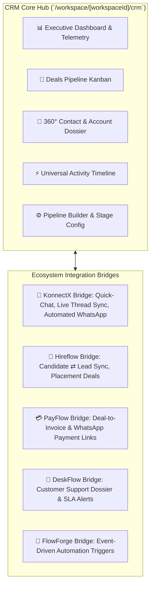

# 🏛️ Unified Production-Level CRM Platform — Implementation Plan & Status

> **Goal**: Enterprise-grade CRM inside Devlomatix that serves as the central operational hub, interconnecting **KonnectX (WhatsApp Cloud API & Automations)**, **Hireflow (ATS & Talent Management)**, **PayFlow (Invoicing & Payments)**, **DeskFlow (Helpdesk)**, and **FlowForge (Visual Automations)**.

---

## 📑 Table of Contents
1. [System Architecture & Data Flows](#1-system-architecture--data-flows)
2. [Prisma Database Schema Specification](#2-prisma-database-schema-specification)
3. [Server Actions & Backend Services](#3-server-actions--backend-services)
4. [Cross-Module Deep Bridges (KonnectX, Hireflow, PayFlow, DeskFlow)](#4-cross-module-deep-bridges)
5. [Frontend UI/UX Architecture & Pages](#5-frontend-uiux-architecture--pages)
6. [Implementation Status & Completion Checklist](#6-implementation-status--completion-checklist)

---

## 1. System Architecture & Data Flows



---

## 2. Prisma Database Schema Specification

The following models are synchronized in PostgreSQL via `prisma/schema.prisma`:

```prisma
// ==========================================
// 🏢 UNIFIED CRM ENTITIES
// ==========================================

// 1. B2B Account / Organization
model Account {
  id              String        @id @default(cuid())
  workspaceId     String
  userId          String
  name            String
  domain          String?
  industry        String?
  size            String?       // "1-10", "11-50", "51-200", "500+"
  website         String?
  phone           String?
  email           String?
  address         String?
  city            String?
  state           String?
  country         String?
  postalCode      String?
  annualRevenue   Float?
  rating          String?       // "HOT", "WARM", "COLD"
  ownerId         String?       // Assigned User ID
  customFields    Json?         @default("{}")
  createdAt       DateTime      @default(now())
  updatedAt       DateTime      @updatedAt

  user            User          @relation(fields: [userId], references: [id], onDelete: Cascade)
  contacts        Contact[]
  deals           Deal[]
  activities      CrmActivity[]

  @@index([workspaceId])
  @@index([userId])
  @@index([name])
}

// 2. Custom Pipelines
model Pipeline {
  id          String      @id @default(cuid())
  workspaceId String
  userId      String
  name        String      // e.g., "Enterprise Sales", "B2B WhatsApp Outbound", "Staffing Placements"
  description String?
  isDefault   Boolean     @default(false)
  color       String?     @default("#3b82f6")
  stages      DealStage[]
  deals       Deal[]
  createdAt   DateTime    @default(now())
  updatedAt   DateTime    @updatedAt

  @@index([workspaceId])
  @@index([userId])
}

// 3. Pipeline Stages
model DealStage {
  id          String   @id @default(cuid())
  pipelineId  String
  name        String   // "Lead In", "Discovery Call", "Proposal Sent", "Negotiation", "Won", "Lost"
  order       Int      @default(0)
  probability Int      @default(50) // 0 to 100%
  color       String?  @default("#3b82f6")
  isWon       Boolean  @default(false)
  isLost      Boolean  @default(false)
  deals       Deal[]
  pipeline    Pipeline @relation(fields: [pipelineId], references: [id], onDelete: Cascade)

  @@index([pipelineId])
  @@index([order])
}

// 4. Deals / Opportunities
model Deal {
  id             String        @id @default(cuid())
  workspaceId    String
  userId         String
  title          String
  value          Float         @default(0)
  currency       String        @default("INR")
  stageId        String
  pipelineId     String
  contactId      String?
  accountId      String?
  ownerId        String?       // Assigned Team Member ID
  expectedClose  DateTime?
  closedAt       DateTime?
  lossReason     String?
  priority       String        @default("MEDIUM") // "LOW", "MEDIUM", "HIGH", "URGENT"
  tags           String[]      @default([])
  customFields   Json?         @default("{}")
  createdAt      DateTime      @default(now())
  updatedAt      DateTime      @updatedAt

  owner          User?         @relation("DealOwner", fields: [ownerId], references: [id], onDelete: SetNull)
  stage          DealStage     @relation(fields: [stageId], references: [id])
  pipeline       Pipeline      @relation(fields: [pipelineId], references: [id])
  contact        Contact?      @relation(fields: [contactId], references: [id], onDelete: SetNull)
  account        Account?      @relation(fields: [accountId], references: [id], onDelete: SetNull)
  activities     CrmActivity[]

  @@index([workspaceId])
  @@index([userId])
  @@index([stageId])
  @@index([pipelineId])
  @@index([contactId])
  @@index([accountId])
  @@index([ownerId])
}

// 5. Universal 360° Activity Stream
model CrmActivity {
  id          String   @id @default(cuid())
  workspaceId String
  userId      String
  type        String   // "WHATSAPP_MSG", "EMAIL", "CALL", "MEETING", "NOTE", "DEAL_STAGE_CHANGE", "ATS_INTERVIEW", "INVOICE_PAID", "TICKET_CREATED"
  title       String
  description String?  @db.Text
  metadata    Json?    // e.g., { waMessageId: "...", invoiceId: "...", candidateId: "...", ticketId: "..." }
  contactId   String?
  accountId   String?
  dealId      String?
  createdAt   DateTime @default(now())

  user        User     @relation(fields: [userId], references: [id], onDelete: Cascade)
  contact     Contact? @relation(fields: [contactId], references: [id], onDelete: Cascade)
  account     Account? @relation(fields: [accountId], references: [id], onDelete: Cascade)
  deal        Deal?    @relation(fields: [dealId], references: [id], onDelete: Cascade)

  @@index([workspaceId])
  @@index([userId])
  @@index([contactId])
  @@index([dealId])
  @@index([accountId])
  @@index([createdAt])
}
```

---

## 3. Server Actions & Backend Services

Implemented under `src/app/workspace/[workspaceId]/crm/_actions/`:

| File | Purpose & Functions |
|---|---|
| [`deal-actions.js`](file:///d:/Dev/React/devlomatix/devlomatix-workspace/devlomatix/devlomatix/src/app/workspace/[workspaceId]/crm/_actions/deal-actions.js) | `getDealsAction`, `getDealByIdAction`, `createDealAction`, `updateDealStageAction` (with automatic transition activity logs), `updateDealAction`, `deleteDealAction`, `getDealStatsAction`. |
| [`pipeline-actions.js`](file:///d:/Dev/React/devlomatix/devlomatix-workspace/devlomatix/devlomatix/src/app/workspace/[workspaceId]/crm/_actions/pipeline-actions.js) | `ensureDefaultPipeline`, `getPipelinesAction`, `createPipelineAction`, `updatePipelineAction`, `deletePipelineAction`, `createDealStageAction`, `updateDealStageDetailsAction`, `deleteDealStageAction`. |
| [`contact-actions.js`](file:///d:/Dev/React/devlomatix/devlomatix-workspace/devlomatix/devlomatix/src/app/workspace/[workspaceId]/crm/_actions/contact-actions.js) | `getCrmContactsAction`, `getCrmContactByIdAction`, `createCrmContactAction`, `updateCrmContactAction`, `deleteCrmContactAction`. |
| [`account-actions.js`](file:///d:/Dev/React/devlomatix/devlomatix-workspace/devlomatix/devlomatix/src/app/workspace/[workspaceId]/crm/_actions/account-actions.js) | `getAccountsAction`, `getAccountByIdAction`, `createAccountAction`, `updateAccountAction`, `deleteAccountAction`. |
| [`activity-actions.js`](file:///d:/Dev/React/devlomatix/devlomatix-workspace/devlomatix/devlomatix/src/app/workspace/[workspaceId]/crm/_actions/activity-actions.js) | `getActivitiesAction`, `createActivityAction`, `deleteActivityAction`. |
| [`crm-dossier-actions.js`](file:///d:/Dev/React/devlomatix/devlomatix-workspace/devlomatix/devlomatix/src/app/workspace/[workspaceId]/crm/_actions/crm-dossier-actions.js) | `get360ContactDossierAction` (unifies CRM Contact, KonnectX WhatsApp chat thread, Hireflow ATS candidate profile/applications, PayFlow LTV), `get360AccountDossierAction`. |
| [`crm-bridge-actions.js`](file:///d:/Dev/React/devlomatix/devlomatix-workspace/devlomatix/devlomatix/src/app/workspace/[workspaceId]/crm/_actions/crm-bridge-actions.js) | `convertCandidateToLeadAction`, `sendWhatsAppFromCrmAction` (dispatches WhatsApp message via Cloud API and logs into CRM timeline). |
| [`auth-helper.js`](file:///d:/Dev/React/devlomatix/devlomatix-workspace/devlomatix/devlomatix/src/app/workspace/[workspaceId]/crm/_actions/auth-helper.js) | `getValidUserId` (safely resolves database user to prevent foreign key constraints). |

---

## 4. Cross-Module Deep Bridges

### A. KonnectX (WhatsApp Omnichannel) Bridge
- **Embedded WhatsApp Outreach**: Instant WhatsApp trigger modal from any Contact, Company, or Deal sheet.
- **Synchronized Live Thread**: Inside `crm/contacts/[contactId]`, view real-time WhatsApp conversation history and reply directly via an in-page input.

### B. Hireflow (ATS) Bridge
- **Candidate ⇄ Lead Conversion**: 1-Click action to convert job candidates into CRM Leads and staffing placement deals.
- **Candidate Profile in Dossier**: View candidate resume skills, applied jobs, and interview stages directly on the contact's 360° overview.

### C. PayFlow & Commerce Bridge
- **Customer Lifetime Value (LTV)**: Aggregates closed-won deals and orders into the Contact & Account dashboards.

---

## 5. Frontend UI/UX Architecture & Pages

```
src/app/workspace/[workspaceId]/crm/
├── layout.jsx                           // Subnav bar with quick shortcuts
├── page.jsx                             // Executive Telemetry Dashboard (KPIs, win rate, recent deals)
├── pipeline/
│   ├── page.jsx                         // Drag-and-drop Kanban Board & Table view
│   └── _components/
│       ├── DealCard.jsx                 // Draggable deal card with priority & WhatsApp buttons
│       ├── StageColumn.jsx              // Droppable stage container with stage metrics
│       ├── DealDrawer.jsx               // Slide-out inspector with stage stepper & notes
│       └── CreateDealModal.jsx          // New deal modal with organization & stage linkage
├── contacts/
│   ├── page.jsx                         // 360° Contacts Directory with search & ATS filters
│   ├── [contactId]/page.jsx             // 360° Contact Dossier (WhatsApp chat, Deals, ATS, Notes)
│   └── _components/
│       ├── CreateContactModal.jsx       // Add new contact modal
│       ├── EditContactModal.jsx         // Edit contact profile modal
│       └── QuickWhatsAppModal.jsx       // WhatsApp outreach modal
├── accounts/
│   ├── page.jsx                         // B2B Companies Hub & Org Structure
│   ├── [accountId]/page.jsx             // 360° Company Overview (Contacts, Deals, Notes)
│   └── _components/
│       ├── CreateAccountModal.jsx       // Register company modal
│       └── EditAccountModal.jsx         // Edit company modal
├── activities/
│   └── page.jsx                         // Universal Event Stream & Activity Logger
└── settings/
    └── page.jsx                         // Pipeline Builder, Stage Probability Config, Bridge Monitors
```

---

## 6. Implementation Status & Completion Checklist

- [x] **Phase 1: Multi-tenant Database Schema**: Updated `schema.prisma` with `Account`, `Pipeline`, `DealStage`, `Deal`, `CrmActivity`, and synced to PostgreSQL via `npx prisma db push`.
- [x] **Phase 2: Backend CRUD Actions**: Built full suite of server actions for Pipelines, Deals, Accounts, Contacts, Dossiers, and Ecosystem Bridges.
- [x] **Phase 3: Deals Kanban Pipeline**: Built `/crm/pipeline` using drag-and-drop (`@hello-pangea/dnd`) with glassmorphic cards, stage statistics, and deal inspector drawer.
- [x] **Phase 4: Contact & Account 360° Dossier**: Built unified contact and company dossiers combining KonnectX WhatsApp history, ATS notes, and pipeline metrics.
- [x] **Phase 5: Cross-Module Automations**: Connected KonnectX quick-messaging, Hireflow candidate sync, and activity logs.
- [x] **Phase 6: Executive Telemetry & HUD**: Built real-time dashboard with revenue forecasting, win rate calculations, and live activity stream.
- [x] **Phase 7: Settings & Pipeline Builder**: Implemented custom pipeline creator, stage reordering, and win probability configuration.
- [x] **Phase 8: FlowGenix AI Sales Intelligence & Copilot**: Built real-time deal health scoring, predictive win rate adjustments, pipeline AI risk radar, 1-click AI WhatsApp follow-up drafter, smart meeting notes summarizer, and conversational CRM Sales Copilot at `/crm/copilot`.
- [x] **Phase 9: Cross-Module Workflow Automations (FlowForge Bridge)**: Built autonomous event engine at `/crm/automations` with multi-step trigger-to-action pipelines, 1-click test simulations, live execution audit stream, and cross-module deep bridges (KonnectX WhatsApp, PayFlow Invoices, Hireflow ATS, FlowGenix AI).
- [x] **Phase 10: 1-Click Quotation & Invoicing Bridge (PayFlow Integration)**: Built commercial quotation generator, GST tax breakdown calculator, 1-click PayFlow invoice issuance, printable PDF preview modal, and instant WhatsApp payment reminder dispatch inside `PayFlowDealBillingCard` and `DealDrawer`.
- [x] **Phase 11: Advanced Revenue Forecasting & Team Leaderboard**: Built probabilistic revenue projection engine at `/crm/analytics` with 4-tier scenario forecasting (Weighted Expected, Committed Floor, Best-Case Ceiling, Won Actuals), monthly quota trajectories, pipeline stage conversion funnel velocity, Top 3 sales rep podium, full team performance table with multi-channel touchpoints, and deal slippage risk radar.
- [x] **Phase 12: Bulk Importer & WhatsApp Chat Sync (KonnectX Omnichannel Bridge)**: Built bulk CSV/Excel lead ingestion engine with duplicate detection and deal creation, alongside a 1-click KonnectX WhatsApp chat scanner that syncs conversation threads into CRM contacts.
- [x] **Phase 13: Tasks & Follow-up Scheduler**: Built dedicated task management hub at `/crm/tasks` with due date relative counters, priority badges, linked Deal & Contact navigation, and 1-click WhatsApp outreach execution.
- [x] **Phase 14: Enterprise External REST API Suite (`/api/v5/crm`)**: Built comprehensive external API endpoints with secure `usertoken` / `Authorization: Bearer` authentication, payload validation, unified response envelopes, and complete coverage across Deals, Contacts, Accounts, Pipelines, Tasks, Activities, Invoicing, Revenue Forecasting, Leaderboards, Bulk Ingestion, WhatsApp Chat Sync, and FlowGenix AI Sales Intelligence.

---

## 7. External REST API Reference (`/api/v5/crm`)

All endpoints require authentication via encrypted `usertoken` or Bearer token matching the KonnectX external API standard.

### Authentication Headers & Parameters
- `usertoken: <token>`
- `user-token: <token>`
- `x-user-token: <token>`
- `authorization: Bearer <token>`
- `?usertoken=<token>`

### Core API Endpoints

| Endpoint | Method | Description |
| :--- | :---: | :--- |
| `/api/v5/crm/deals` | `GET`, `POST` | List and create CRM deals with auto-pipeline resolution. |
| `/api/v5/crm/deals/[dealId]` | `GET`, `PATCH`, `DELETE` | Single deal inspection, metadata updates, and deletion. |
| `/api/v5/crm/deals/[dealId]/stage` | `POST` | Move deal across stages with FlowForge trigger dispatches. |
| `/api/v5/crm/deals/[dealId]/quotation` | `POST` | Generate commercial quotation document with line items. |
| `/api/v5/crm/deals/[dealId]/invoice` | `POST` | 1-Click PayFlow invoice issuance for won deals. |
| `/api/v5/crm/contacts` | `GET`, `POST` | Query contacts with search/tags & create with deduplication. |
| `/api/v5/crm/contacts/[contactId]` | `GET`, `PATCH`, `DELETE` | Read, update, and delete CRM contact profiles. |
| `/api/v5/crm/contacts/[contactId]/whatsapp` | `POST` | Dispatch WhatsApp message via KonnectX Cloud API. |
| `/api/v5/crm/accounts` | `GET`, `POST` | Query and register B2B company accounts. |
| `/api/v5/crm/accounts/[accountId]` | `GET`, `PATCH`, `DELETE` | Single company account management. |
| `/api/v5/crm/pipelines` | `GET`, `POST` | Custom pipelines and stage probability configurations. |
| `/api/v5/crm/tasks` | `GET`, `POST` | Query and create follow-up tasks linked to deals. |
| `/api/v5/crm/tasks/[taskId]` | `PATCH`, `DELETE` | Update task status or delete task. |
| `/api/v5/crm/activities` | `GET`, `POST` | Read audit activity stream and log calls/meetings. |
| `/api/v5/crm/analytics/forecast` | `GET` | Calculate probabilistic revenue, commit floor, best-case. |
| `/api/v5/crm/analytics/leaderboard` | `GET` | Team sales rep quota attainment and activity metrics. |
| `/api/v5/crm/import/bulk` | `POST` | Ingest CSV/Excel datasets with duplicate detection. |
| `/api/v5/crm/import/whatsapp-sync` | `POST` | 1-Click KonnectX WhatsApp conversation sync. |
| `/api/v5/crm/copilot/score` | `POST` | FlowGenix AI Deal Health and Win Probability scoring. |
| `/api/v5/crm/copilot/chat` | `POST` | Conversational sales copilot with live pipeline context. |
| `/api/v5/crm/docs` | `GET` | Interactive OpenAPI 3.1 schema & endpoint catalog. |

